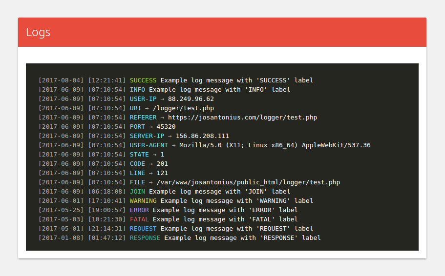

# PHP Logger library

[](https://packagist.org/packages/josantonius/logger) [](https://packagist.org/packages/josantonius/logger) [](https://packagist.org/packages/josantonius/logger) [](https://packagist.org/packages/josantonius/logger) [](https://travis-ci.org/Josantonius/PHP-Logger)

[Spanish version](README-ES.md)

Biblioteca php para crear logs fácilmente y almacenarlos en formato Json.

---

- [Instalación](#instalación)
- [Requisitos](#requisitos)
- [Imágenes](#imágenes)
- [Cómo empezar y ejemplos](#cómo-empezar-y-ejemplos)
- [Métodos disponibles](#métodos-disponibles)
- [Uso](#uso)
- [Tests](#tests)
- [Tareas pendientes](#-tareas-pendientes)
- [Contribuir](#contribuir)
- [Repositorio](#repositorio)
- [Licencia](#licencia)
- [Copyright](#copyright)

---

### Instalación 

La mejor forma de instalar esta extensión es a través de [composer](http://getcomposer.org/download/).

Para instalar PHP Logger library, simplemente escribe:

    $ composer require Josantonius/Logger

El comando anterior sólo instalará los archivos necesarios, si prefieres descargar todo el código fuente (incluyendo tests, directorio vendor, excepciones no utilizadas, documentos...) puedes utilizar:

    $ composer require Josantonius/Logger --prefer-source

También puedes clonar el repositorio completo con Git:

    $ git clone https://github.com/Josantonius/PHP-Logger.git

### Requisitos

Esta biblioteca es soportada por versiones de PHP 5.6 o superiores y es compatible con versiones de HHVM 3.0 o superiores.

### Imágenes





### Cómo empezar y ejemplos

Para utilizar esta biblioteca, simplemente:

```php
require __DIR__ . '/vendor/autoload.php';

use Josantonius\Logger\Logger;
```

### Métodos disponibles

Métodos disponibles en esta biblioteca:

**Iniciador para la gestión de logs del sitio.**

```php
Logger($path, $filename, $logNumber, $ip, $states);
```

Atributo | Descripción | Tipo | Requerido | Predeterminado
| --- | --- | --- | --- | --- |
| $path | Ruta donde guardar los logs | string | No | null |
| $filename | Nombre de archivo JSON que guardará los registros | string | No | null |
| $logNumber | Número máximo de logs guardar en el archivo | int | No | 200 |
| $ip | IP del usuario | string | No | null |
| $states | Diferentes estados para los logs | array | No | null |

- **@return** → void

---

**Guardar log.**

```php
Logger::save($type, $code, $msg, $line, $file, $data);
```

Atributo | Descripción | Tipo | Requerido | Predeterminado
| --- | --- | --- | --- | --- |
| $type | Tipo de error o aviso | string | Yes | |
| $code | Código de estado de respuesta HTTP | int | Yes | |
| $message | Mensaje | string | Yes | |
| $line | Línea desde la que se guarda el log | int | Yes | |
| $file | Ruta del archivo desde el que se llama el método | string | Yes | |
| $data | Parámetros extra personalizados | array | No | 0 |

- **@return** → boolean

---

**Guarda los registros en archivo JSON.**

```php
Logger::store();
```

- **@return** → boolean

---

**Obtener logs guardados.**

```php
Logger::get();
```

- **@return** → array → logs guardados

---

**Definir directorio para scripts y obtener url del archivo.**

```php
Logger::script($url);
```

Atributo | Descripción | Tipo | Requerido | Predeterminado
| --- | --- | --- | --- | --- |
| $url | File url | string | Yes | |

- **@return** → string → url del archivo

---

**Definir directorio para estilos y obtener url del archivo.**

```php
Logger::style($url);
```

Atributo | Descripción | Tipo | Requerido | Predeterminado
| --- | --- | --- | --- | --- |
| $url | File url | string | Yes | |

- **@return** → string → url del archivo

---

**Obtener el número de logs guardados en la sección actual.**

```php
Logger:added();
```

- **@return** → int → logs añadidos en la sección actual

---

**Mostrar sección de registros**

```php
Logger:render();
```

- **@return** → boolean true

---

**Restablecer parámetros.**

```php
Logger:reset();
```

- **@return** → boolean true

---

### Uso

Ejemplo de uso para esta biblioteca:

#### Ejemplo básico

```php
<?php
require __DIR__ . '/vendor/autoload.php';

use Josantonius\Logger\Logger;

new Logger();

Logger::save('SUCCESS',  100, 'msg', __LINE__, __FILE__);
Logger::save('JOIN',     200, 'msg', __LINE__, __FILE__);
Logger::save('INFO',     300, 'msg', __LINE__, __FILE__);
Logger::save('WARNING',  400, 'msg', __LINE__, __FILE__);
Logger::save('ERROR',    500, 'msg', __LINE__, __FILE__);
Logger::save('FATAL',    600, 'msg', __LINE__, __FILE__);
Logger::save('REQUEST',  700, 'msg', __LINE__, __FILE__);
Logger::save('RESPONSE', 800, 'msg', __LINE__, __FILE__);

Logger::storeLogs();
```

#### Ejemplo avanzado

```php
<?php
require __DIR__ . '/vendor/autoload.php';

use Josantonius\Logger\Logger;

$states  = [

  'global'    => true,
  'exception' => true,
  'error'     => false,
  'notice'    => false,
  'fatal'     => true,
];

new Logger('/logger/', 'logs', 600, '58.80.84.44', $states);

Logger::save('EXCEPTION', 400, 'msg', __LINE__, __FILE__);
Logger::save('ERROR' ,    402, 'msg', __LINE__, __FILE__);
Logger::save('NOTICE',    100, 'msg', __LINE__, __FILE__);

$params = [

  'id-user'   => 68,
  'name-user' => 'Joe'
]; 
        
Logger::save('FATAL, 500, 'msg', __LINE__, __FILE__, $params);

Logger::storeLogs();

echo 'Logs added: ' . Logger::added();

echo 'Logs added: ' . count(Logger::get);

printf('<link href="%s">', Logger::style('http://site.com/public/css/'));

printf('<script src="%s">', Logger::script('http://site.com/public/js/'));

Logger::render();
```

### Tests 

Para ejecutar las [pruebas](tests/Logger/Test) simplemente:

    $ git clone https://github.com/Josantonius/PHP-Logger.git
    
    $ cd PHP-Logger

    $ phpunit

### ☑ Tareas pendientes

- [x] Completar tests
- [ ] Mejorar la documentación


### Contribuir
1. Comprobar si hay incidencias abiertas o abrir una nueva para iniciar una discusión en torno a un fallo o función.
1. Bifurca la rama del repositorio en GitHub para iniciar la operación de ajuste.
1. Escribe una o más pruebas para la nueva característica o expón el error.
1. Haz cambios en el código para implementar la característica o reparar el fallo.
1. Envía pull request para fusionar los cambios y que sean publicados.

Esto está pensado para proyectos grandes y de larga duración.

### Repositorio

Los archivos de este repositorio se crearon y subieron automáticamente con [Reposgit Creator](https://github.com/Josantonius/BASH-Reposgit).

### Licencia

Este proyecto está licenciado bajo **licencia MIT**. Consulta el archivo [LICENSE](LICENSE) para más información.

### Copyright

2017 Josantonius, [josantonius.com](https://josantonius.com/)

Si te ha resultado útil, házmelo saber :wink:

Puedes contactarme en [Twitter](https://twitter.com/Josantonius) o a través de mi [correo electrónico](mailto:hello@josantonius.com).