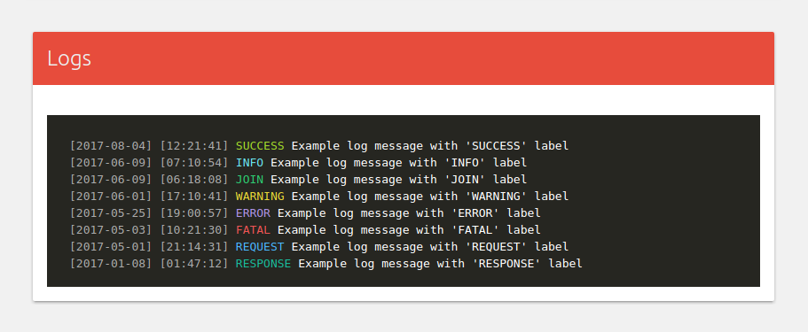
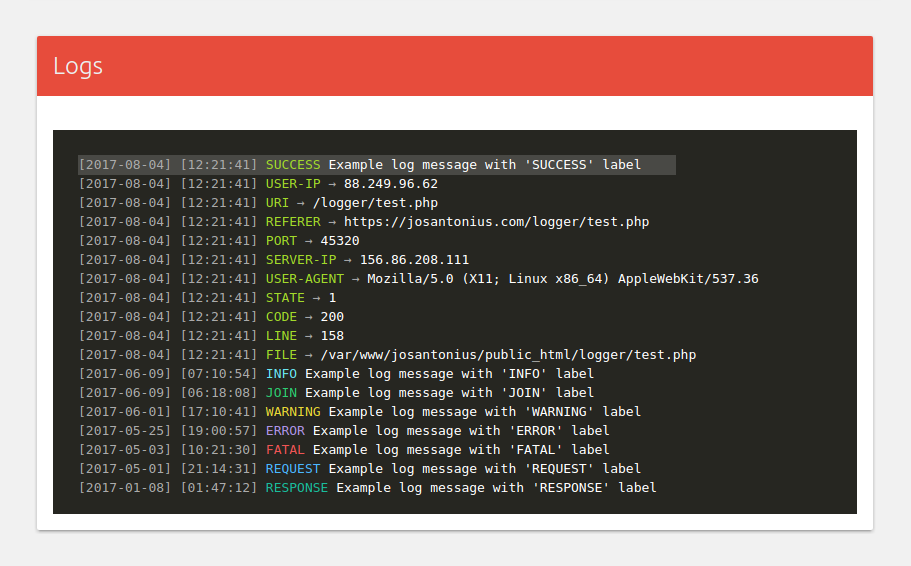
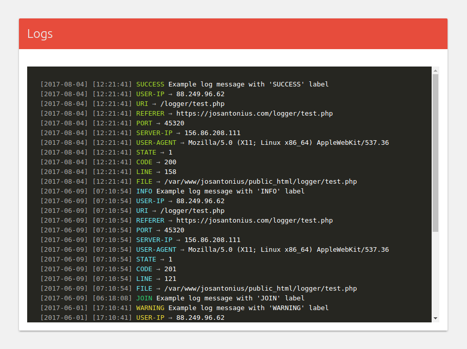
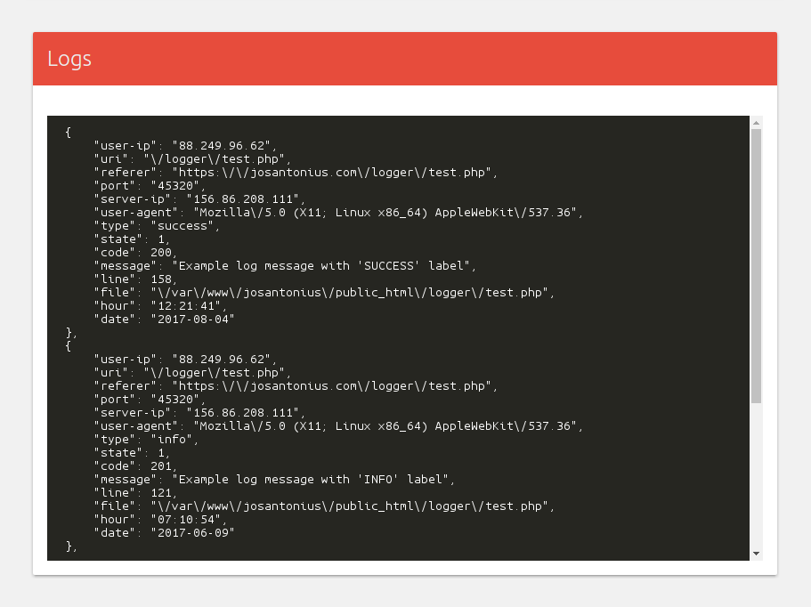

# PHP Logger library

[](https://packagist.org/packages/josantonius/logger) [](https://packagist.org/packages/josantonius/logger) [](https://packagist.org/packages/josantonius/logger) [](https://packagist.org/packages/josantonius/logger) [](https://travis-ci.org/Josantonius/PHP-Logger)

[Spanish version](README-ES.md)

Php library to create logs easily and store them in Json format.

---

- [Installation](#installation)
- [Requirements](#requirements)
- [Images](#images)
- [Quick Start and Examples](#quick-start-and-examples)
- [Available Methods](#available-methods)
- [Usage](#usage)
- [Tests](#tests)
- [TODO](#-todo)
- [Contribute](#contribute)
- [Repository](#repository)
- [License](#license)
- [Copyright](#copyright)

---

### Installation

The preferred way to install this extension is through [composer](http://getcomposer.org/download/).

To install PHP Logger library, simply:

    $ composer require Josantonius/Logger

The previous command will only install the necessary files, if you prefer to download the entire source code (including tests, vendor folder, exceptions not used, docs...) you can use:

    $ composer require Josantonius/Logger --prefer-source

Or you can also clone the complete repository with Git:

    $ git clone https://github.com/Josantonius/PHP-Logger.git

### Requirements

This library is supported by PHP versions 5.6 or higher and is compatible with HHVM versions 3.0 or higher.

### Images







### Quick Start and Examples

To use this class, simply:

```php
require __DIR__ . '/vendor/autoload.php';

use Josantonius\Logger\Logger;
```

### Available Methods

Available methods in this library:

**Initiator for site debug management.**

```php
Logger($path, $filename, $logNumber, $ip, $states);
```

| Atttribute | Description | Type | Required | Default
| --- | --- | --- | --- | --- |
| $path | Path name to save file with logs | string | No | null |
| $filename | JSON file name that will save the logs | string | No | null |
| $logNumber | Maximum number of logs to save to file | int | No | 200 |
| $ip | If you want to get to another library | string | No | null |
| $states | Different states for logs | array | No | null |

- **@return** → void

---

**Save log line.**

```php
Logger::save($type, $code, $msg, $line, $file, $data);
```

| Atttribute | Description | Type | Required | Default
| --- | --- | --- | --- | --- |
| $type | Error type or warning | string | Yes | |
| $code | HTTP response status code | int | Yes | |
| $message | Message | string | Yes | |
| $line | Line from which the save is executed | int | Yes | |
| $file | Filepath from which the method is called | string | Yes | |
| $data | Extra custom parameters | array | No | 0 |

- **@return** → boolean

---

**Save logs to Json file.**

```php
Logger::store();
```

- **@return** → boolean

---

**Get saved logs.**

```php
Logger::get();
```

- **@return** → array → logs saved

---

**Define directory for scripts and get url from file.**

```php
Logger::script($url);
```

| Atttribute | Description | Type | Required | Default
| --- | --- | --- | --- | --- |
| $url | File url | string | Yes | |

- **@return** → string → file url

---

**Define directory for styles and get url from file.**

```php
Logger::style($url);
```

| Atttribute | Description | Type | Required | Default
| --- | --- | --- | --- | --- |
| $url | File url | string | Yes | |

- **@return** → string → file url

---

**Get number of logs added in the current section.**

```php
Logger:added();
```

- **@return** → int → logs added in the current section

---

**Display logger section.**

```php
Logger:render();
```

- **@return** → boolean true

---

**Reset parameters.**

```php
Logger:reset();
```

- **@return** → boolean true

---

### Usage

Example of use for this library:

#### Basic example

```php
<?php
require __DIR__ . '/vendor/autoload.php';

use Josantonius\Logger\Logger;

new Logger();

Logger::save('SUCCESS',  100, 'msg', __LINE__, __FILE__);
Logger::save('JOIN',     200, 'msg', __LINE__, __FILE__);
Logger::save('INFO',     300, 'msg', __LINE__, __FILE__);
Logger::save('WARNING',  400, 'msg', __LINE__, __FILE__);
Logger::save('ERROR',    500, 'msg', __LINE__, __FILE__);
Logger::save('FATAL',    600, 'msg', __LINE__, __FILE__);
Logger::save('REQUEST',  700, 'msg', __LINE__, __FILE__);
Logger::save('RESPONSE', 800, 'msg', __LINE__, __FILE__);

Logger::storeLogs();
```

#### Advanced example

```php
<?php
require __DIR__ . '/vendor/autoload.php';

use Josantonius\Logger\Logger;

$states  = [

  'global'    => true,
  'exception' => true,
  'error'     => false,
  'notice'    => false,
  'fatal'     => true,
];

new Logger('/logger/', 'logs', 600, '58.80.84.44', $states);

Logger::save('EXCEPTION', 400, 'msg', __LINE__, __FILE__);
Logger::save('ERROR' ,    402, 'msg', __LINE__, __FILE__);
Logger::save('NOTICE',    100, 'msg', __LINE__, __FILE__);

$params = [

  'id-user'   => 68,
  'name-user' => 'Joe'
]; 
        
Logger::save('FATAL, 500, 'msg', __LINE__, __FILE__, $params);

Logger::storeLogs();

echo 'Logs added: ' . Logger::added();

echo 'Logs added: ' . count(Logger::get);

printf('<link href="%s">', Logger::style('http://site.com/public/css/'));

printf('<script src="%s">', Logger::script('http://site.com/public/js/'));

Logger::render();
```

### Tests 

To run [tests](tests/Logger/Test) simply:

    $ git clone https://github.com/Josantonius/PHP-Logger.git
    
    $ cd PHP-Logger

    $ phpunit

### ☑ TODO

- [x] Create tests
- [x] Improve documentation

### Contribute

1. Check for open issues or open a new issue to start a discussion around a bug or feature.
1. Fork the repository on GitHub to start making your changes.
1. Write one or more tests for the new feature or that expose the bug.
1. Make code changes to implement the feature or fix the bug.
1. Send a pull request to get your changes merged and published.

This is intended for large and long-lived objects.

### Repository

All files in this repository were created and uploaded automatically with [Reposgit Creator](https://github.com/Josantonius/BASH-Reposgit).

### License

This project is licensed under **MIT license**. See the [LICENSE](LICENSE) file for more info.

### Copyright

2017 Josantonius, [josantonius.com](https://josantonius.com/)

If you find it useful, let me know :wink:

You can contact me on [Twitter](https://twitter.com/Josantonius) or through my [email](mailto:hello@josantonius.com).